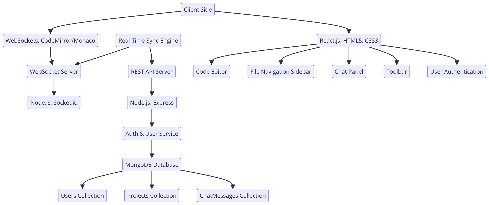
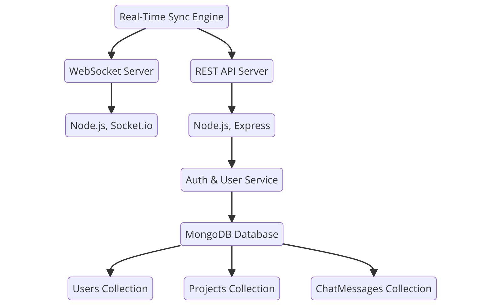

# SyncCode: Real-Time Collaborative Code Editor


## Table of Contents
- [SyncCode: Real-Time Collaborative Code Editor](#synccode-real-time-collaborative-code-editor)
  - [Table of Contents](#table-of-contents)
  - [Introduction](#introduction)
  - [Features](#features)
  - [System Design](#system-design)
    - [High-Level Design](#high-level-design)
    - [Low-Level Design](#low-level-design)
  - [Installation](#installation)
    - [Prerequisites](#prerequisites)
    - [Steps](#steps)
  - [Usage](#usage)
  - [Contributing](#contributing)
  - [License](#license)

## Introduction
SyncCode is a real-time collaborative code editor designed for seamless team collaboration. It features real-time synchronization, syntax highlighting, code autocompletion, version control integration, and an inbuilt chat system, making it an ideal tool for developers to code together efficiently and effectively.

## Features
- Real-Time Collaboration: Multiple users can edit the same document simultaneously with changes reflected in real-time.
- Syntax Highlighting: Support for various programming languages with different colors for keywords, variables, and comments.
- Code Autocompletion: Intelligent code suggestions and completions with snippet support for common code patterns.
- Version Control Integration: Integration with Git for version control, including commit, push, pull, and branch functionalities.
- Chat Feature: Inbuilt chat functionality for user communication, supporting text, emojis, and file sharing.
- User Authentication and Authorization: Secure login and registration system with role-based access control.
- Document History and Revisions: Track changes and view document history with the ability to revert to previous versions.
- Code Formatting and Linting: Automated code formatting and real-time linting to identify and fix errors.
- Themes and Customization: Light and dark modes with customizable themes and font sizes.
- Live Preview: Real-time preview of code output for web-based projects with support for HTML, CSS, and JavaScript live rendering.

## System Design

### High-Level Design


### Low-Level Design


## Installation

### Prerequisites
- Node.js
- MongoDB
- Git

### Steps
1. Clone the repository:
    ```bash
    git clone https://github.com/your-username/SyncCode.git
    ```
2. Navigate to the project directory:
    ```bash
    cd SyncCode
    ```
3. Install dependencies:
    ```bash
    npm install
    ```
4. Start the MongoDB server.
5. Run the application:
    ```bash
    npm start
    ```

## Usage
1. Open your browser and navigate to `http://localhost:3000`.
2. Register a new account or log in with existing credentials.
3. Create or open a project and start collaborating in real-time!

## Contributing
We welcome contributions to SyncCode! To contribute, follow these steps:
1. Fork the repository.
2. Create a new branch:
    ```bash
    git checkout -b feature-name
    ```
3. Make your changes.
4. Commit your changes:
    ```bash
    git commit -m "Add feature"
    ```
5. Push to the branch:
    ```bash
    git push origin feature-name
    ```
6. Open a pull request.

## License
SyncCode is licensed under the MIT License. See the [LICENSE](LICENSE) file for more details.
